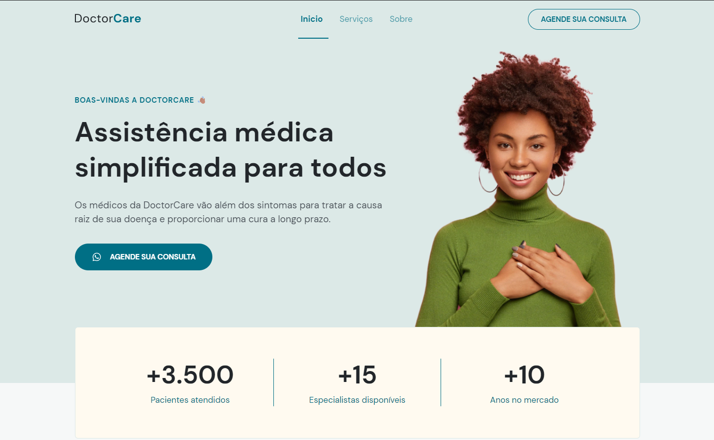
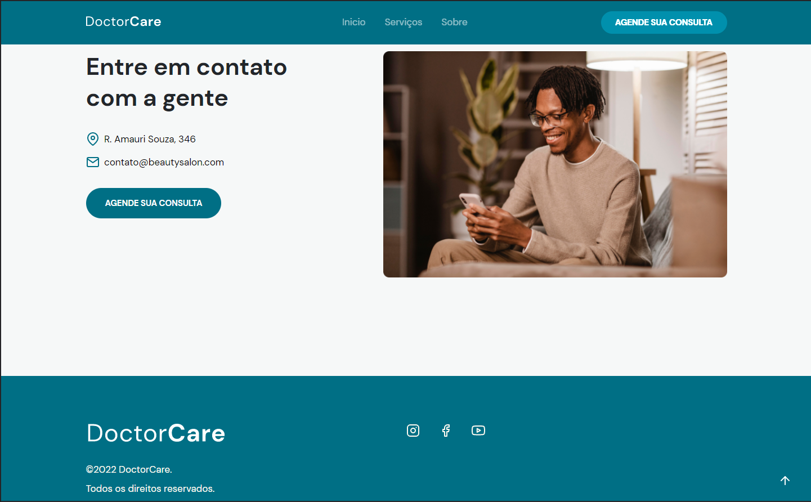

 

<h2>🚀 O PROJETO</h2>
 

Projeto criado na 8ª edição do evento NLW com o título de Return. 
A aplicação desta vez foi destinado a area da saúde pessoal, o site DoctorCare contém um resumo do que esperar dos atendimentos, um resumo de pacientes atendidos, campos de detalhamento dos serviços 
disponibilizados e a seção de contatos.  
A aplicação está responsiva para aparelhos com o width acima de 320px.

 

<h2>🛠️ AS TECNOLOGIAS</h2>
 

 

 
 
 
  
<h2>🔨 BIBLIOTECA</h2>
 

 

A biblioteca SCROLLREVEAL foi utilizada para animar os elementos na página a medida que aparecem ou somem.

[ScrollReveal](https://scrollrevealjs.org/guide/hello-world.html)

 

<h2>💡APRENDIZADOS</h2>

➡️ O uso correto das TAGs dentro do HTML (mantendo a semântica) mostra que a aplicação dos estilos CSS ficam mais claras.

➡️ Se a intenção é colocar responsividade na aplicação, comece o desenvolvimento pelo menor dispositivo, isso facilitará a criação da responsividade.

➡️ O JavaScript faz coisas que nem sonhamos, basta saber o que quer e procurar.

 
 

<h2>💻 Layout Completo </h2>
  
O Layout oficial disponibilizado pela Rocketseat pode ser localizado no link abaixo.
Para visualizar é necessário ter uma conta no Figma.

[DoctorCare - Figma](https://www.figma.com/community/file/1102912263666619803)

 
 

<h2> GitHub Pages </h2>

[Doctor Care - Projeto Finalizado](https://jaquelinejrs.github.io/NLW-Return/)

 
 

 
 

 
 

